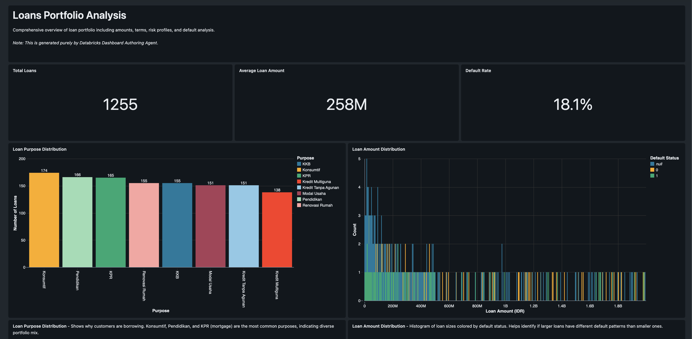
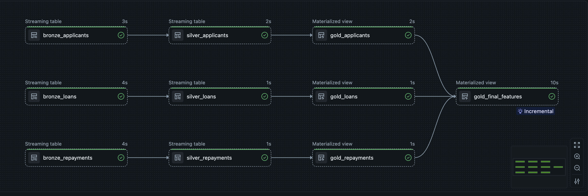
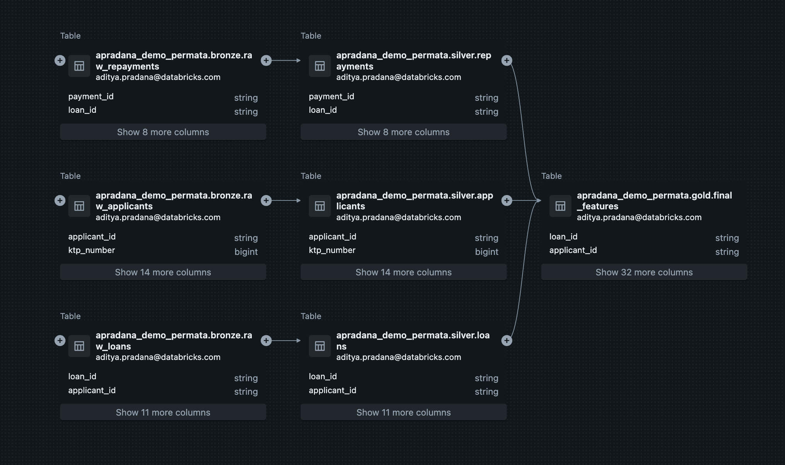

# Databricks Credit Scoring Workshop
This repository contains the materials for a Databricks workshop focused on credit scoring. The workshop includes notebooks, datasets, and instructions for building a credit scoring model using Databricks. This workshop is useful for data practitioners in the financial industry who want to learn how to leverage Databricks for credit scoring and risk assessment.

This workshop covers data ingestion, processing, data exploration, machine learning with MLFlow, data governance, up to AI/BI with dashboard and Genie spaces.

## ⭐ Databricks Free Edition
This workshop can run on the [Databricks Free Edition](https://databricks.com/try-databricks) which provides a free cluster with 15 GB of memory and 6 GB of storage. You can sign up for the free edition using your email address.

How to sign up for Databricks Free Edition:
1. Go to the [Databricks Free Edition sign-up page](https://databricks.com/try-databricks).
2. Enter your email address and click "Get Started".
3. Follow the instructions in the email to create your account and set up your workspace.

## 🚀 Following the Workshop
1. Clone this repository to your local machine.
2. Have your Databricks Free Edition account & workspace ready.
3. Upload the notebook `notebooks/00-setup.ipynb` to your Databricks workspace and run it to set up the environment.
4. Import the datasets from `datasets` directory to your Databricks workspace under the directory `/Volumes/{your-catalog}/{your-schema}/{your-volume}/credit_datasets`.
5. Follow the notebooks in order, starting from `notebooks/01-Data-Ingestion.ipynb` to `notebooks/05-Data-Governance.ipynb`, to complete the workshop.

## Example Dashboards & Lineages

Some dashboards created during the workshop:

### Loans Porfolio Dashboard

### Medallion Layer

### Data Lineage
